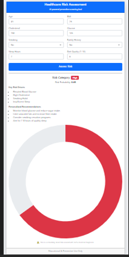
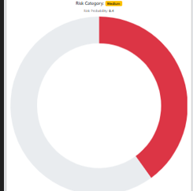
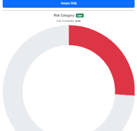

# **🏥 Healthcare Risk Assessment System (ML + Web App)**

## **🔍 Project Overview**

This project is an end-to-end healthcare risk assessment system built for screening and preventive insights, not medical diagnosis.

It uses machine learning to classify individuals into Low, Medium, or High health risk categories based on lifestyle, demographic, and clinical indicators.

The system is deployed as a Flask web application with explainability and personalized recommendations.

## **🎯 Business Objective**

Support early risk screening and preventive care

Avoid overconfident predictions in uncertain healthcare data

Provide transparent, explainable outcomes

Deliver a professional, user-friendly web interface

**## 🧠 Machine Learning Design Model Choice**

Algorithm: Random Forest Classifier

Problem Type: Binary classification (screening-level)

Key Design Decision

Extreme-risk cases are anchored deterministically, while mid-risk cases remain probabilistic to reduce label noise.

This mirrors real-world healthcare uncertainty and improves prediction realism.

**## 📊 Risk Categorization Logic**

Probability Range	Risk Category
< 0.30	Low Risk
0.30 – 0.60	Medium Risk
> 0.60	High Risk

➡️ Risk categories represent population-relative screening risk, not diagnosis.

**## 🔍 Explainability & Recommendations Explainability**

Displays top contributing risk drivers for each prediction

Rule-based local explainability for transparency

Personalized Recommendations

Lifestyle-focused, non-diagnostic suggestions

Shown only for Medium and High risk users

**## 🌐 Web Application Features**

Responsive Bootstrap-based UI

Auto-filled realistic default values

Risk probability visualization using Chart.js

Clear healthcare disclaimer

Modular Flask backend

**## 🛠 Technology Stack**

Programming Language: Python 3.11

Libraries: Pandas, NumPy, Scikit-learn

Web Framework: Flask

UI: Bootstrap 5

Visualization: Chart.js

Model Persistence: Joblib

## ▶️ How to Run Locally

### **Step 1: Activate Environment**

conda activate healthcare_ml

### **Step 2: Load Dataset Dataset**

python generate_healthcare_dataset.py

### **Step 3: Train Model**
python train_model.py

### **Step 4: Run Web Application**

python app.py

Open in browser:

## **http://127.0.0.1:5000**

## **_⚠️ Disclaimer_**

This application is intended for educational and screening purposes only.
It does not provide medical diagnosis or treatment advice.

## **📸 Screenshots**

# 👤 Author

## **Kamal Sharma**

### **Healthcare Analytics | Machine Learning | Consulting**